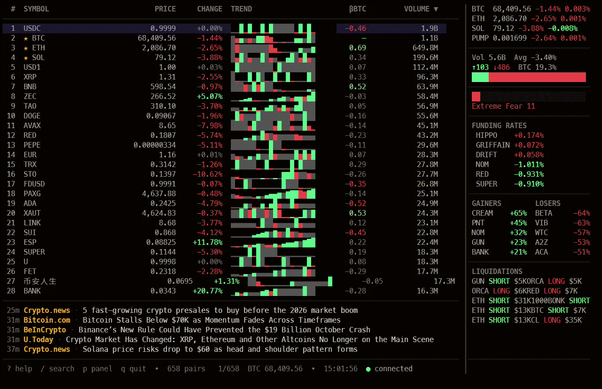

# cryptstream-tui

Live cryptocurrency ticker in your terminal — real-time Binance WebSocket stream with a Bloomberg-style dark aesthetic.



## Features

- Real-time USDT pair prices via Binance WebSocket
- Per-tick heatmap sparklines (green/red per bar)
- Market Pulse sidebar with BTC/ETH/SOL, aggregate stats, top 10 gainers/losers
- Watchlist — star any coin to pin it in the sidebar
- Gainers/losers filter
- Live search by symbol
- Price delta flash on updates (green up, red down)
- Sortable columns (volume, price, change, symbol)
- Responsive layout — columns adapt to terminal width
- In-app settings editor with live preview
- Configurable colors, flash duration, sparkline length, and more
- Help screen with grouped keybind reference

## Install

### Homebrew (macOS / Linux)

```bash
brew install moneycaringcoder/tap/cryptstream
```

### Scoop (Windows)

```powershell
scoop bucket add moneycaringcoder https://github.com/moneycaringcoder/scoop-bucket
scoop install cryptstream
```

### Go

```bash
go install github.com/moneycaringcoder/cryptstream-tui/cmd/cryptstream@latest
```

Requires Go 1.24+. The binary is installed to `$GOPATH/bin` (usually `~/go/bin`).

### Pre-built binaries

Download the latest release for your platform from [Releases](https://github.com/moneycaringcoder/cryptstream-tui/releases). Extract and place the binary somewhere on your `PATH`.

## Updating

### Homebrew

```bash
brew upgrade cryptstream
```

### Scoop

```powershell
scoop update cryptstream
```

### Go

```bash
go install github.com/moneycaringcoder/cryptstream-tui/cmd/cryptstream@latest
```

## Run from source

```bash
git clone https://github.com/moneycaringcoder/cryptstream-tui
cd cryptstream-tui
go run ./cmd/cryptstream
```

## Keys

| Key | Action |
|-----|--------|
| `j` / `k` | Scroll up/down |
| `g` / `G` | Jump to top/bottom |
| `tab` / `shift+tab` | Cycle sort column |
| `s` | Star/unstar symbol (adds to sidebar) |
| `f` | Cycle filter (all/gainers/losers) |
| `p` | Toggle sidebar panel |
| `/` | Search symbols |
| `c` | Open settings editor |
| `?` | Toggle help screen |
| `esc` | Clear search / close overlay |
| `q` / `ctrl+c` | Quit |

## Configuration

Settings are stored in `%APPDATA%/cryptstream/config.json` (Windows) or `~/.config/cryptstream/config.json` (Linux/macOS). You can edit them directly or press `c` in the app.

Configurable options include flash duration, sparkline length, sort defaults, filter count, flash threshold, panel layout, connection URLs, and a full 9-color theme. Changes in the settings editor apply immediately.

## Stack

- [tuikit-go](https://github.com/moneycaringcoder/tuikit-go) — TUI component toolkit
- [Bubble Tea](https://github.com/charmbracelet/bubbletea) — TUI framework
- [Lip Gloss](https://github.com/charmbracelet/lipgloss) — Styling
- [gorilla/websocket](https://github.com/gorilla/websocket) — WebSocket client

## License

[MIT](LICENSE)
